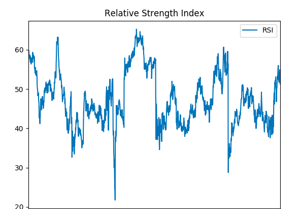

# alpha-vantage-examples
Alpha Vantage Examples and Scripts that I will use in YouTube videos. Feel free to check them out.

My YouTube to see the videos:
https://www.youtube.com/channel/UCJHs6RO1CSM85e8jIMmCySw

I left an API key in all these scripts so they would run out of the box. You'll need to get your own API key which can be found here: 
https://www.alphavantage.co/support/#api-key

## 1. Time Series Intraday 
(Script provided by Alpha Vantage https://www.alphavantage.co/documentation/ )

Returns data on the intraday timeseries of a stock specified by the symbol keyword arguement in the ts.get_intraday method.

Multiple output formats, pandas was selected in this script, close prices of each minute plotted with matplotlib
https://github.com/Derrick-Sherrill/alpha-vantage-examples/blob/master/timeseries_example.py

## 2. Simple Moving Average VS. Intraday Time Series

Combination of the technical indicators and time series API calls. Plotted against each other here:

Simple moving average here being calculated by last 60 minutes. Adjust for own purposes. 

https://github.com/Derrick-Sherrill/alpha-vantage-examples/blob/master/sma_vs_close.py

## 3. Exponential Moving Average 

Calculating the EMA over each minute, using the last 60 minutes for the calculation.

https://github.com/Derrick-Sherrill/alpha-vantage-examples/blob/master/exponential_moving_average.py

## 4. Stoichastic Oscillator 
Please note the below script was used on a stock, not a security. Demonstration purposes only.

https://github.com/Derrick-Sherrill/alpha-vantage-examples/blob/master/stochastic_oscillator.py 

## 5. Weighted Moving Average
Weighted moving average of Microsoft:

https://github.com/Derrick-Sherrill/alpha-vantage-examples/blob/master/weighted_moving_average.py

## 6. Relative Strength Index
RSI is a momentum indicator that that measures the magnitude  of recent price changes to evaluate overbought or oversold conditions in the price of a stock or other asset.

https://github.com/Derrick-Sherrill/alpha-vantage-examples/blob/master/relative_strength_index.py

## 7. RSI vs Close prices
Plotting RSI against closing prices on the same graph, two y axis.

https://github.com/Derrick-Sherrill/alpha-vantage-examples/blob/master/rsi_vs_close.py

## 8. SMA plotted with RSI (Two TI's)
Plotting two technical indicators on the same graph using twinx() in matplotlib

https://github.com/Derrick-Sherrill/alpha-vantage-examples/blob/master/sma_and_rsi.py

#### Sources
https://www.alphavantage.co/documentation/
Chen, James. “Relative Strength Index – RSI.” Investopedia, Investopedia, 10 June 2019, www.investopedia.com/terms/r/rsi.asp.
